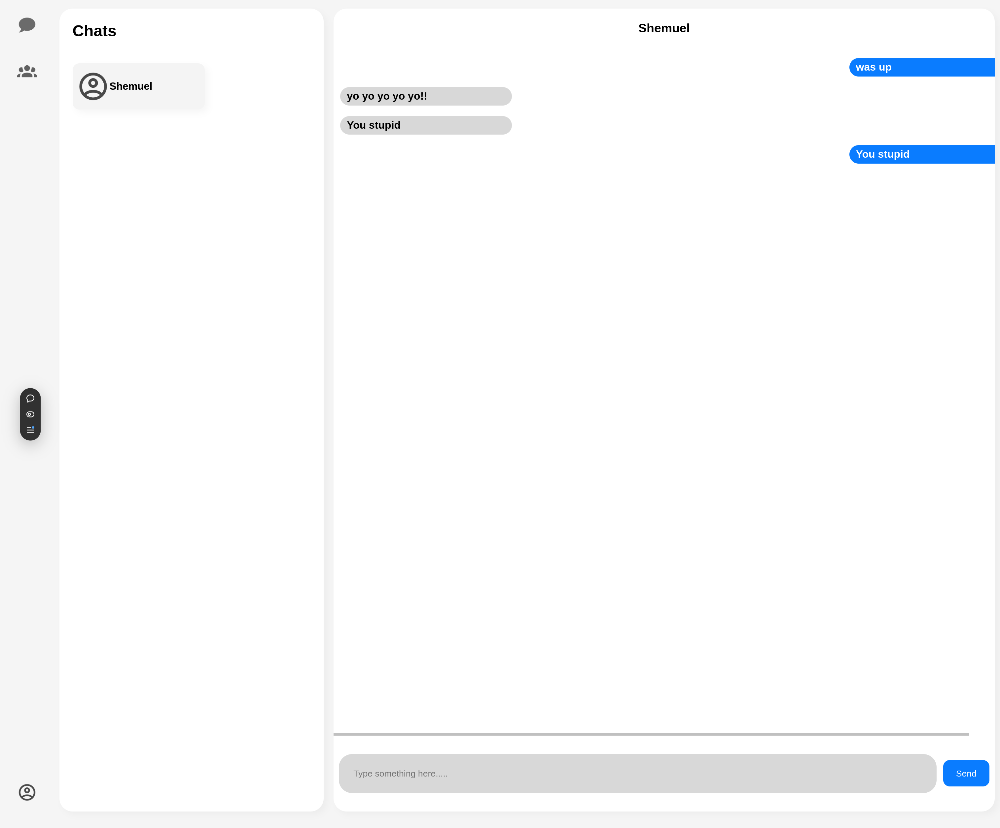

# Messenger app backend

<!-- logo -->
<div align="center">
  
  <p>Simple messaging app!</p>
</div>


https://messaging-app-seven-gilt.vercel.app/
## About
<div align="center">
  
</div>

### description
This is a simple messaging app that allows you to message people one on one and edit your profile information.
This specific repository is backend code.

### built with
These are tools that I used to build the site

<ul>
  <li>
    <a href="https://react.dev/">React</a>
  </li>
  <li>
    <a href="https://nodejs.org/en">Node.js</a>
  </li>
  <li>
    <a href="https://expressjs.com/">Express</a>
  </li>
  <li>
    <a href="https://www.postgresql.org/">Postgresql</a>
  </li>
  <li>
    <a href="https://www.prisma.io/">Prisma</a>
  </li>
  <li>
    <a href="https://www.passportjs.org/">Passport</a>
  </li>
</ul>

### frontend repository
https://github.com/Shemuel-bot/messaging-app.git

## Local setup

```sh
npm install -g nodemon
nodemon index.js
```
